# QuickServe (v0.0.1) — Proje Akış Dokümantasyonu-16/04/2026

> Oluşturulma: 2026-04-16  
> Kapsam: Flutter frontend + Spring Boot backend — tüm roller için tam akış analizi + eksik implementasyon raporu

---

## İçindekiler

1. [Mimari Özet](#1-mimari-özet)
2. [Roller ve Yetki Hiyerarşisi](#2-roller-ve-yetki-hiyerarşisi)
3. [Kimlik Doğrulama Akışı](#3-kimlik-doğrulama-akışı)
4. [Müşteri Akışı](#4-müşteri-akışı)
5. [Garson (WAITER / HEAD_WAITER) Akışı](#5-garson-waiter--head_waiter-akışı)
6. [Mutfak (CHEF) Akışı](#6-mutfak-chef-akışı)
7. [Restoran Admin Akışı](#7-restoran-admin-akışı)
8. [Superadmin Akışı](#8-superadmin-akışı)
9. [Bildirim ve WebSocket Mimarisi](#9-bildirim-ve-websocket-mimarisi)
10. [Eksiklik ve Akış Kırıklıkları Raporu](#10-eksiklik-ve-akış-kırıklıkları-raporu)

---

## 1. Mimari Özet

```
┌─────────────────────────────────────────────────────────┐
│                  Flutter Uygulaması                      │
│  GoRouter · Riverpod · Dio · STOMP (stomp_dart_client)  │
└──────────────────────────┬──────────────────────────────┘
                           │ HTTP / WebSocket (SockJS)
┌──────────────────────────▼──────────────────────────────┐
│              Spring Boot Backend (:8080)                  │
│  /api/**  ·  Spring Security JWT  ·  JPA / Hibernate    │
│  Swagger: /swagger-ui.html                               │
└──────────────────────────┬──────────────────────────────┘
                           │ JPA
┌──────────────────────────▼──────────────────────────────┐
│                  PostgreSQL Veritabanı                    │
└─────────────────────────────────────────────────────────┘
```

### Kimlik Doğrulama Mekanizmaları

| Taraf    | Mekanizma              | Header / Storage               |
|----------|------------------------|-------------------------------|
| Personel | JWT Bearer Token       | `Authorization: Bearer <token>` |
| Müşteri  | Session Token (QR ile) | `X-Session-Token: <token>`    |

---

## 2. Roller ve Yetki Hiyerarşisi

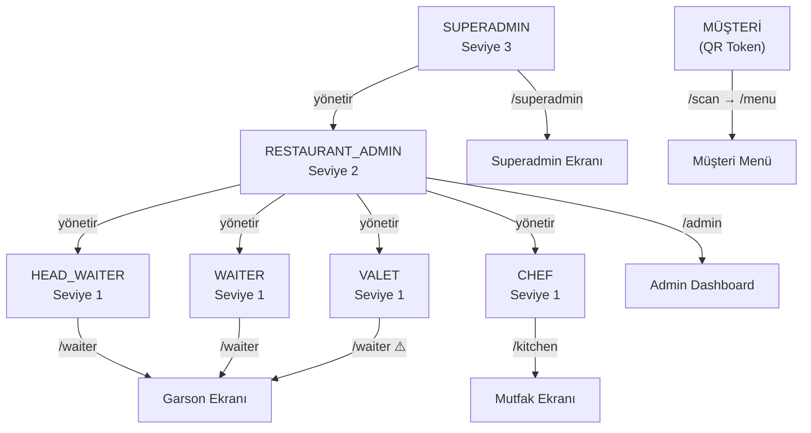

> ⚠️ `VALET` rolü şu an garson ekranına yönlendiriyor. Ayrı ekranı yok.  
> ⚠️ `HEAD_WAITER` ile `WAITER` arasında UI'da hiçbir fark yok.

### Rota Tablosu

| Rota | Erişim | Ekran |
|------|--------|-------|
| `/scan` | Herkese açık | QR Okuyucu |
| `/scan/:qrToken` | Herkese açık | Menü (QR token ile) |
| `/menu` | Herkese açık | Menü (token olmadan — yetki hatası verir) |
| `/cart` | Herkese açık | Sepet ⚠️ (artık kullanılmıyor) |
| `/payment` | Müşteri | Ödeme |
| `/review` | Müşteri | Değerlendirme |
| `/login` | Herkese açık | Personel Girişi |
| `/waiter` | WAITER / HEAD_WAITER / VALET | Garson Paneli |
| `/kitchen` | CHEF | Mutfak Paneli |
| `/admin` | RESTAURANT_ADMIN | Admin Dashboard |
| `/superadmin` | SUPERADMIN | Superadmin Paneli |

---

## 3. Kimlik Doğrulama Akışı

### 3a. Personel Girişi (JWT)

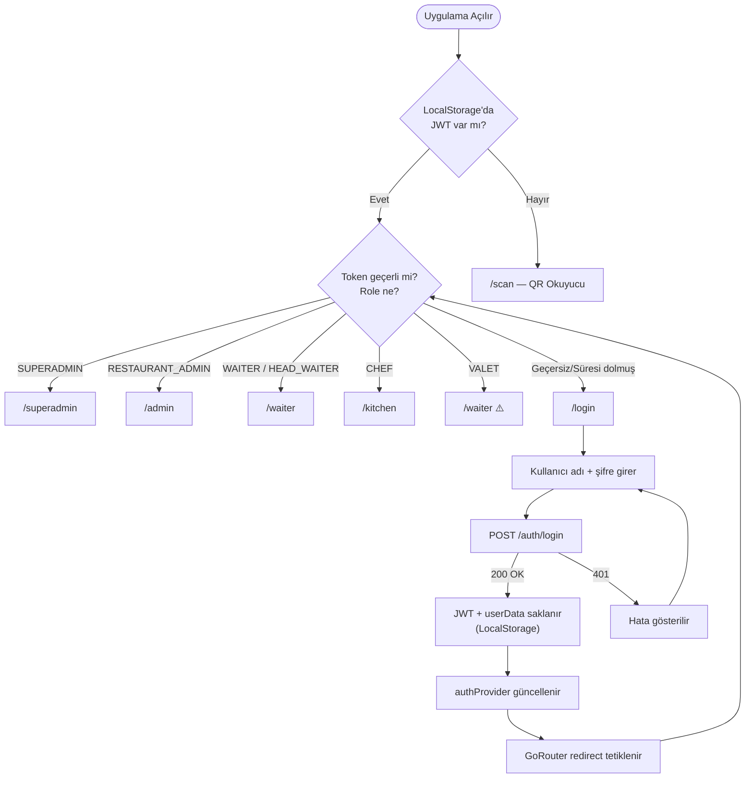

### 3b. Çıkış

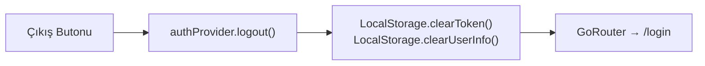

---

## 4. Müşteri Akışı

### 4a. QR Okutma → Menüye Erişim

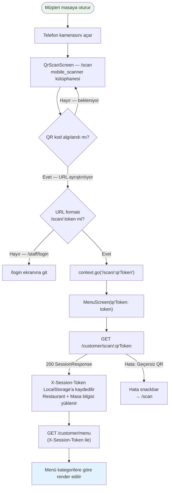

### 4b. Menü Ekranı — Tam Akış

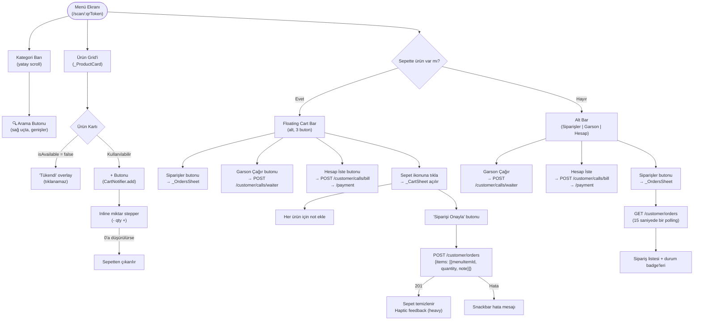

### 4c. Sipariş Durum Takibi (Müşteri Tarafı)

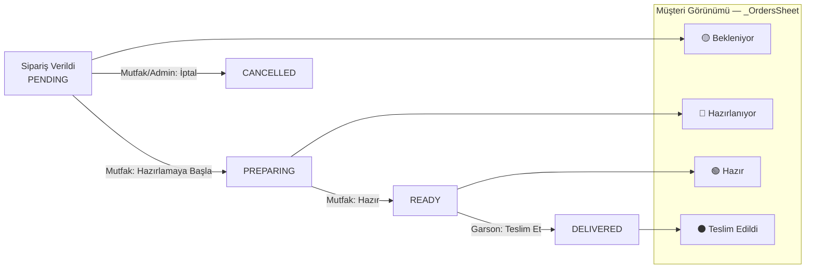

> ⚠️ **Akış Kırıklığı**: Müşteri sipariş durumunu 15 saniyede bir polling ile görüyor. WebSocket ile anlık bildirim gelmiyor (bkz. Bölüm 10, Sorun #3).

### 4d. Ödeme Akışı

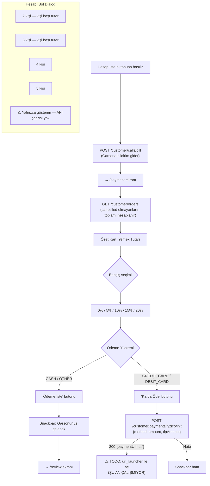

> ⚠️ **Kart ödemesi çalışmıyor** — `paymentUrl` alınıyor fakat `url_launcher` çağrısı implement edilmemiş.  
> ⚠️ **Hesabı Böl** — Yalnızca görsel hesap gösteriyor, `POST /customer/payments/split` hiç çağrılmıyor.

### 4e. Değerlendirme ve Oturum Kapatma

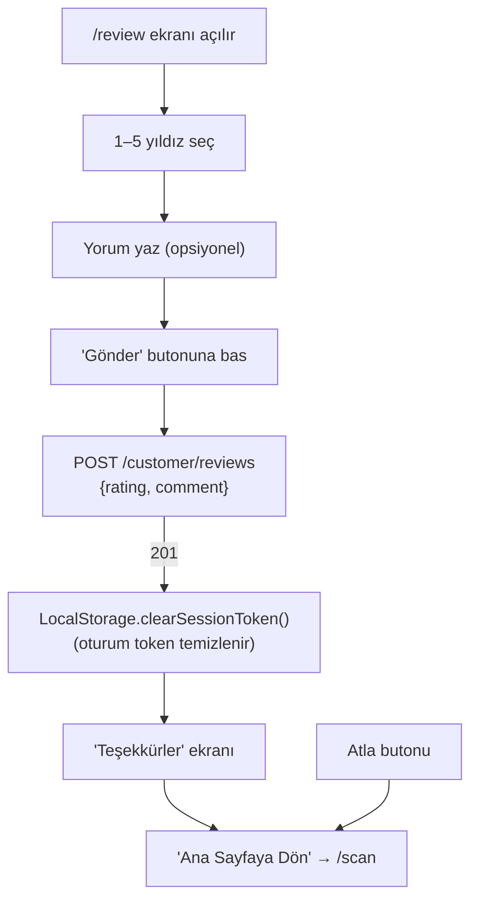

---

## 5. Garson (WAITER / HEAD_WAITER) Akışı

### 5a. Genel Ekran Yapısı

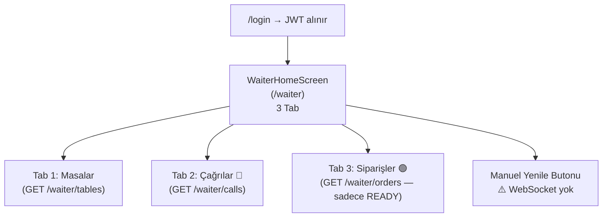

### 5b. Masalar Sekmesi

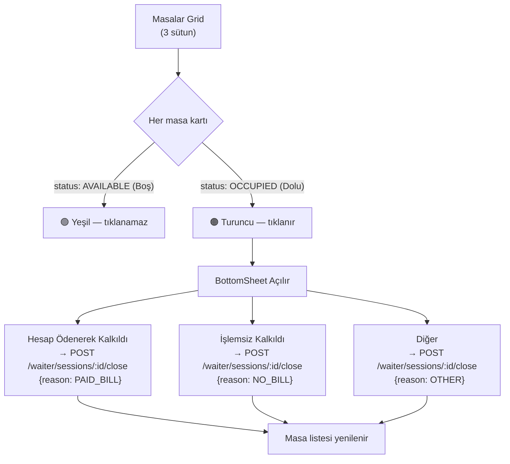

> ⚠️ **Akış Kırıklığı**: Garson masayı kapattığında ödeme kaydı **oluşturulmuyor**. `POST /waiter/payments/cash` endpoint'i var ama hiç çağrılmıyor. Nakit ödeme backend'e yazılmıyor (bkz. Bölüm 10, Sorun #6).

### 5c. Çağrılar Sekmesi

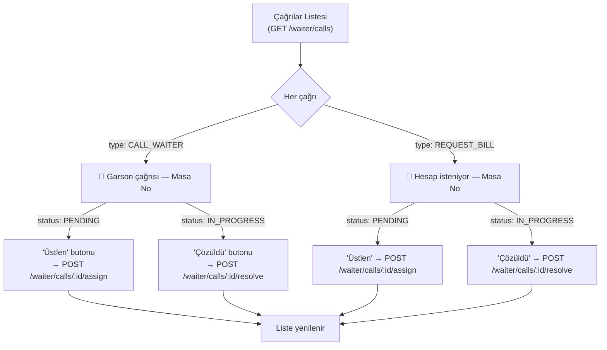

> ⚠️ **Akış Kırıklığı**: Müşteri garson çağırdığında backend WebSocket ile bildirim gönderiyor fakat garson ekranı WebSocket dinlemiyor. Garson yeni çağrıyı ancak manuel yenileme yaparak görüyor (bkz. Bölüm 10, Sorun #3).

### 5d. Siparişler Sekmesi (Teslim Edilecekler)

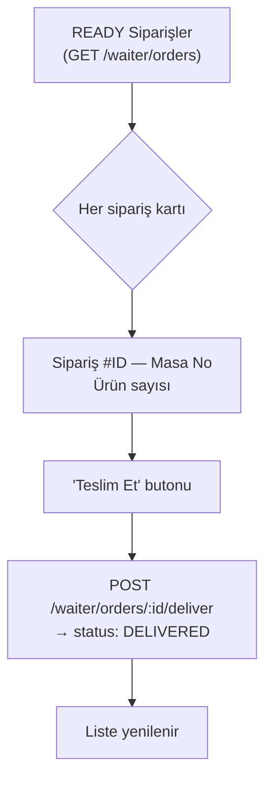

---

## 6. Mutfak (CHEF) Akışı

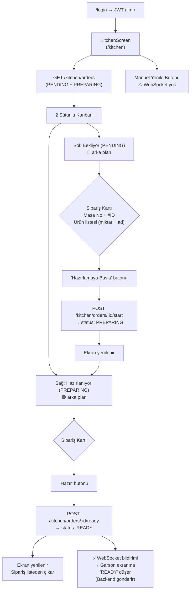

> ⚠️ **Akış Kırıklığı**: Yeni sipariş geldiğinde mutfak ekranı anlık güncellenmez — manuel yenile gerekiyor (bkz. Bölüm 10, Sorun #3).  
> ⚠️ **Implement Edilmemiş**: Mutfak üzerinden ürün müsaitlik yönetimi (stok durumu) için backend endpoint'ler var ama UI yok (bkz. Bölüm 10, Sorun #7).

---

## 7. Restoran Admin Akışı

### 7a. Dashboard Yapısı

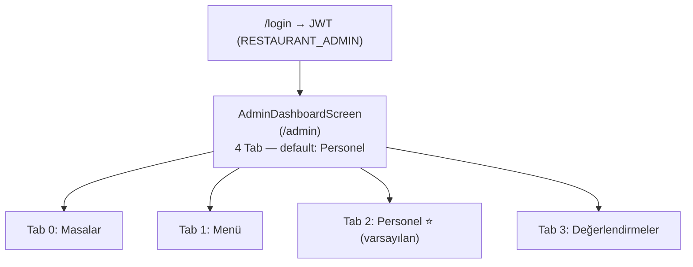

### 7b. Masalar Sekmesi

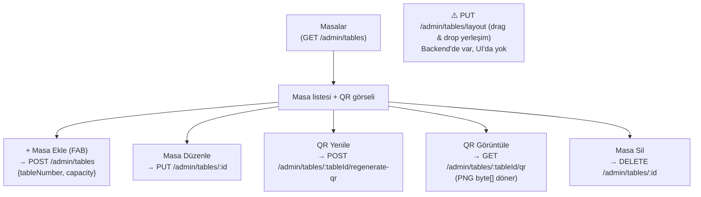

### 7c. Menü Sekmesi

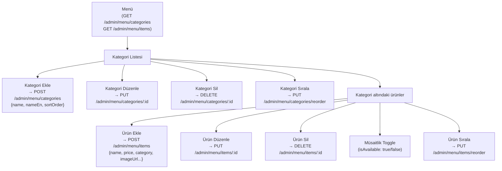

### 7d. Personel Sekmesi

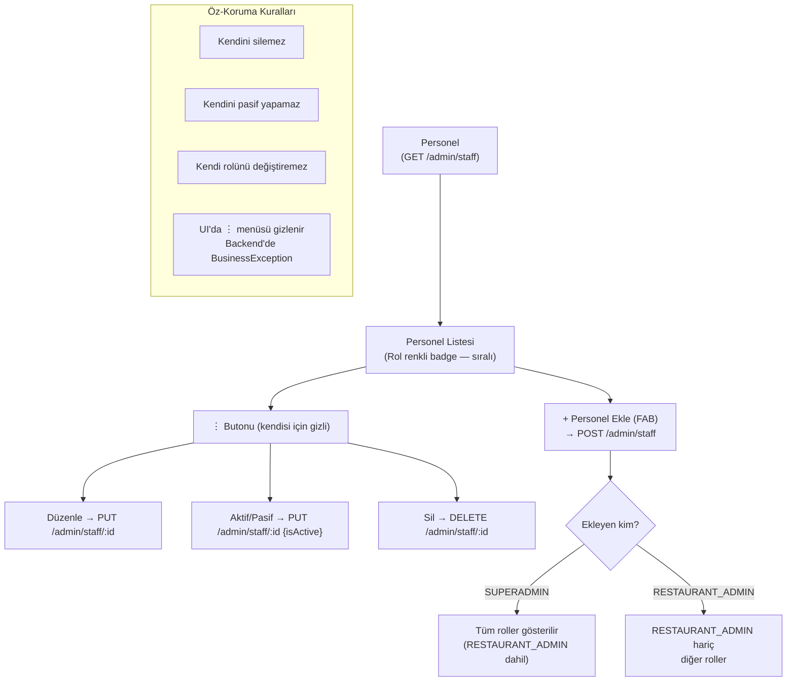

### 7e. Değerlendirmeler Sekmesi

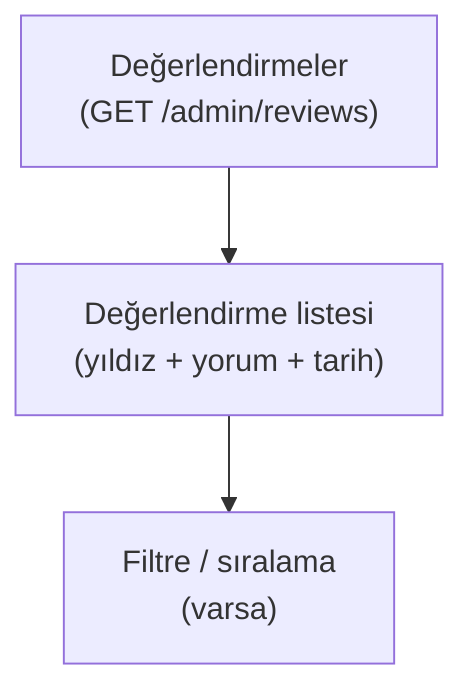

---

## 8. Superadmin Akışı

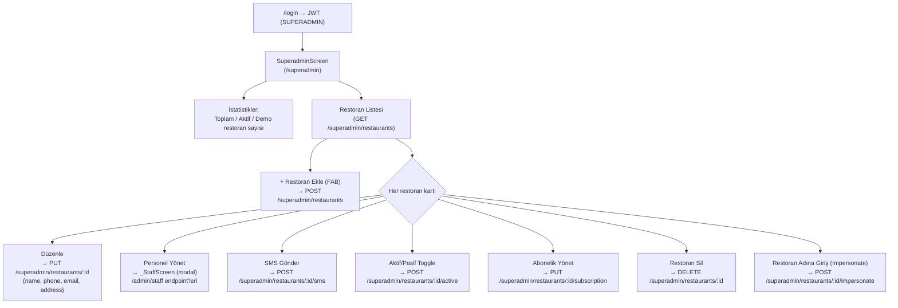

---

## 9. Bildirim ve WebSocket Mimarisi

### 9a. Backend Gönderim Noktaları

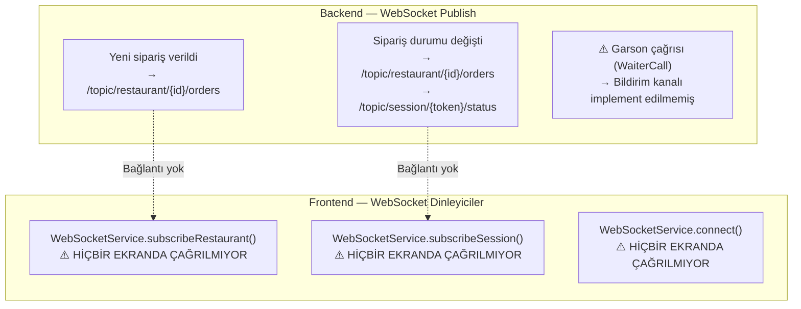

### 9b. Mevcut (Çalışan) Güncelleme Mekanizmaları

| Ekran | Güncelleme Yöntemi | Sıklık |
|-------|--------------------|--------|
| Mutfak | Manuel yenile butonu | Elle |
| Garson | Manuel yenile butonu | Elle |
| Müşteri (Sipariş durumu) | `Timer.periodic` polling | 15 saniye |
| Admin | Manuel yenile butonu | Elle |

---

## 10. Eksiklik ve Akış Kırıklıkları Raporu

### Kritik — Akışı Tamamen Kıran Sorunlar

---

#### Sorun #1: Kart Ödemesi Çalışmıyor

**Nerede:** `payment_screen.dart` → `_pay()` metodu  
**Ne oluyor:** `POST /customer/payments/iyzico/init` çağrısı yapılıyor ve backend `paymentUrl` döndürüyor. Fakat URL, `url_launcher` ile açılmıyor — yorum satırına alınmış.

```dart
// TODO: res.data['paymentUrl'] → url_launcher ile aç
```

**Etki:** Kredi/banka kartı seçen müşteri ödeme yapamaz; herhangi bir geri bildirim almadan işlem sessizce biter.

**Çözüm:**
1. `pubspec.yaml`'a `url_launcher` ekle
2. `_pay()` içinde `launchUrl(Uri.parse(res.data['paymentUrl']))` çağır
3. Callback URL'ini backend'de ayarla

---

#### Sorun #2: Hesabı Böl — API Hiç Çağrılmıyor

**Nerede:** `payment_screen.dart` → `_showSplitDialog()`  
**Ne oluyor:** Dialog açılıyor, kişi başı tutar hesaplanıyor, fakat seçim yapınca yalnızca `Navigator.pop(ctx)` çalışıyor. `POST /customer/payments/split` hiç çağrılmıyor.

**Etki:** Müşteri "hesabı böl" yaptığını sanıyor; aslında hiçbir şey olmuyor.

**Çözüm:** Seçim butonunun `onPressed`'ine `ApiClient.instance.post(ApiConstants.customerPaymentsSplit, data: {...})` ekle.

---

#### Sorun #3: WebSocket Bağlantısı Hiç Kurulmuyor

**Nerede:** `websocket_service.dart` yazılmış; `kitchen_screen.dart`'ta `// TODO(WEBSOCKET)` yorumu var.  
**Ne oluyor:** `WebSocketService.connect()` hiçbir ekranda çağrılmıyor. Mutfak, garson ve müşteri ekranları anlık bildirim almıyor.

**Etki Zinciri:**
- Yeni sipariş geldiğinde mutfak ekranı güncellenmiyor → garson manuel yenileme yapmak zorunda
- Sipariş "READY" olduğunda garson ekranı güncellenmiyor → garson manuel yenileme yapmak zorunda  
- Müşteri sipariş çağırıca garson ekranına anlık düşmüyor → garson çağrıyı kaçırabilir
- Sipariş durumu değiştiğinde müşteri 15 saniye gecikmeyle öğreniyor

**Çözüm:**
- `kitchen_screen.dart`'ta `initState`'de `WebSocketService.instance.connect(jwtToken: ..., baseUrl: ...)` çağır
- `subscribeRestaurant(restaurantId, 'orders', ...)` ile PENDING/PREPARING siparişleri dinle
- `waiter_home_screen.dart`'ta aynısını yap ve çağrı + hazır sipariş kanallarını dinle
- `menu_screen.dart`'ta `subscribeSession(sessionToken, 'status', ...)` ile sipariş durumu dinle → `Timer.periodic` polling kaldırılabilir

---

#### Sorun #4: Nakit Ödeme Kaydı Oluşturulmuyor

**Nerede:** `waiter_home_screen.dart` → `_closeSession()` / `_TablesTab`  
**Ne oluyor:** Garson masayı "Hesap Ödenerek Kalkıldı" seçeneğiyle kapatıyor; `POST /waiter/sessions/:id/close` çağrılıyor fakat `POST /waiter/payments/cash` hiç çağrılmıyor.

**Etki:** Nakit ödeme veritabanına kayıt edilmiyor. Ödeme geçmişi, raporlama ve muhasebe çalışmıyor.

**Çözüm:** `PAID_BILL` durumunda `_closeSession()` öncesinde `POST /waiter/payments/cash` çağır.

---

### Önemli — Eksik Özellikler

---

#### Sorun #5: Sepet Ekranı (/cart) Artık Kullanılmıyor

**Nerede:** `cart_screen.dart`, rota tanımında `/cart`  
**Ne oluyor:** Eski `CartScreen` hâlâ bir rota olarak var. Yeni `menu_screen.dart` kendi `_CartSheet`'ini kullanıyor. `/cart`'a hiçbir yerden gidilmiyor fakat dosya yerinde duruyor.

**Etki:** Ölü kod. Karışıklığa yol açar.

**Çözüm:** `cart_screen.dart` dosyasını ve `/cart` rota tanımını sil; `routes.dart`'tan çıkar.

---

#### Sorun #6: VALET Rolü Ekranı Yok

**Nerede:** `routes.dart`  
**Ne oluyor:**
```dart
case 'VALET':
  return '/waiter'; // TODO: Create valet screen
```
**Etki:** Vale, garson ekranına düşüyor; ilgisi olmayan çağrı ve sipariş bilgilerini görüyor.

---

#### Sorun #7: Mutfak — Ürün Müsaitlik Yönetimi Ekranı Yok

**Nerede:** `kitchen_screen.dart`  
**Backend'de olan endpoint'ler (UI YOK):**
- `POST /kitchen/menu/{restaurantId}/items/{itemId}/availability` — ürünü stokta yok işaretle
- `POST /kitchen/menu/{restaurantId}/items/{itemId}/restore` — ürünü tekrar müsait yap
- `POST /kitchen/orders/{orderId}/priority` — sipariş içi ürün öncelik sırasını güncelle

**Etki:** Mutfak "ürün bitti" durumunu sisteme giremez; menü manuel olarak admin tarafından güncellenebiliyor.

---

#### Sorun #8: Masa Yerleşim Editörü (Layout) Yok

**Nerede:** Admin dashboard → Masalar sekmesi  
**Backend'de olan endpoint:** `PUT /admin/tables/layout`  
**Etki:** Masaların fiziksel yerleşimi sistemde güncellenemiyor.

---

#### Sorun #9: HEAD_WAITER Rolü UI'da WAITER'dan Farksız

**Nerede:** `routes.dart`, `waiter_home_screen.dart`  
**Ne oluyor:** Her ikisi de `/waiter`'a yönlendiriliyor. Baş garsonun ekstra yetkileri (örn. masa kapatma yetkisi sadece HEAD_WAITER'da olabilir) uygulanmıyor.

---

#### Sorun #10: Müşteri Oturumunun Kapanmasından Haberdar Edilmiyor

**Senaryo:** Garson masayı kapatıyor → `POST /waiter/sessions/:id/close` → müşterinin session token'ı geçersiz oluyor.  
**Ne oluyor:** Müşteri hâlâ menü ekranında duruyor, sipariş vermeye çalışıyor; backend 401/404 dönüyor.  
**Etki:** Kötü müşteri deneyimi — anlaşılmaz hata mesajları alıyor.

**Çözüm:** Backend, oturum kapandığında WebSocket ile `/topic/session/{token}/status` kanalına `SESSION_CLOSED` eventi göndersin; müşteri menü ekranı bunu dinleyerek `/review`'a yönlendirsin.

---

### Düşük Öncelik / Bilgi Notu

---

#### Sorun #11: `GET /customer/payments` Endpoint'i Kullanılmıyor

Backend `GET /customer/payments` endpoint'i mevcut fakat frontend hiçbir yerde çağırmıyor. Ödeme geçmişi müşteriye gösterilmiyor.

---

#### Sorun #12: RadioListTile Deprecation Uyarıları

**Nerede:** `payment_screen.dart` — ödeme yöntemi seçimi  
**Ne oluyor:** Flutter 3.32+ `RadioListTile.groupValue` ve `RadioListTile.onChanged`'i deprecate etti; `RadioGroup` ancestor kullanılmasını öneriyor.  
**Etki:** Yalnızca IDE uyarısı — çalışmayı etkilemiyor.

---

## Özet Tablo

| # | Sorun | Kritiklik | Etkilenen Rol | Durum |
|---|-------|-----------|---------------|-------|
| 1 | Kart ödemesi çalışmıyor (url_launcher eksik) | 🔴 Kritik | Müşteri | Açık |
| 2 | Hesabı Böl API çağrısı yok | 🔴 Kritik | Müşteri | Açık |
| 3 | WebSocket hiç bağlanmıyor | 🔴 Kritik | Müşteri / Garson / Mutfak | Açık |
| 4 | Nakit ödeme kaydedilmiyor | 🔴 Kritik | Garson | Açık |
| 5 | /cart ekranı ölü kod | 🟡 Önemli | — | Açık |
| 6 | VALET ekranı yok | 🟡 Önemli | Vale | Açık |
| 7 | Mutfak ürün müsaitlik UI yok | 🟡 Önemli | Mutfak | Açık |
| 8 | Admin masa layout editörü yok | 🟡 Önemli | Admin | Açık |
| 9 | HEAD_WAITER = WAITER (fark yok) | 🟡 Önemli | Baş Garson | Açık |
| 10 | Oturum kapanma bildirimi yok | 🟡 Önemli | Müşteri | Açık |
| 11 | GET /customer/payments kullanılmıyor | 🔵 Düşük | Müşteri | Açık |
| 12 | RadioListTile deprecation uyarısı | 🔵 Düşük | — | Açık |
