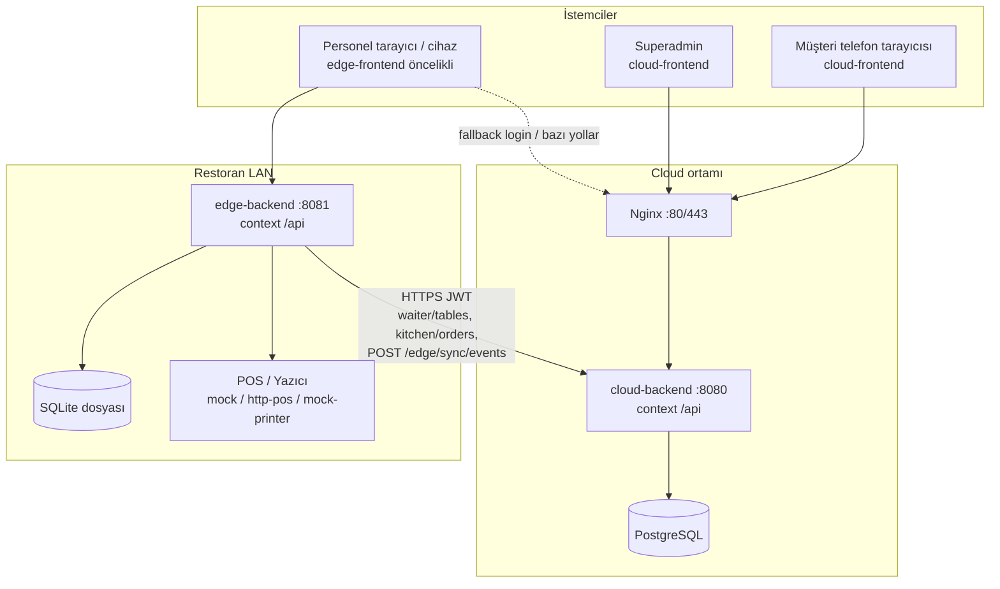

# QuickServe — Sistem ve Proje Referansı (Canonical)

**Amaç:** Projenin *şu anki* teknik durumunu, topolojisini, dağıtımını, eksiklerini ve tipik iş/hata senaryolarını tek yerde toplamak. İnsan operatörü veya sonradan gelen geliştirici/AI asistanı birkaç dosyaya bakarak “ne var, ne yok, nasıl çalışır” sorusunu hızlıca cevaplayabilsin.

**Son güncelleme:** 2026-05-08  
**İlgili kısa rehberler:** [CLAUDE.md](../CLAUDE.md) (geliştirici komutları), [customer_and_support_sop_index.md](customer_and_support_sop_index.md), [cloud_edge_master_delivery_plan.md](cloud_edge_master_delivery_plan.md), [waiter_terminal_master_plan.md](waiter_terminal_master_plan.md) (garson terminali backlog)

---

**Repo giriş:** Kök [README.md](../README.md) bu dosyaya ve `CLAUDE.md`'ye bağlanır.

## Bu belgeyi nasıl kullanmalısınız?

| İhtiyaç | Bölüm |
|--------|--------|
| Repo yapısı, hangi klasör ne işe yarar | §3 |
| Üretim mimarisi, cloud vs edge | §4–§5 |
| Özellik listesi (yüksek seviye) | §6 |
| Staff müşteri API’si nereye gider | §7 |
| Canlıya çıkış ve deploy | §9–§10 |
| Bilinen delikler, yapılacaklar | §11–§12 |
| Örnek iş / felaket senaryoları | §13–§14 |
| Diğer dokümanlara köprü | §15 |

---

## 1. Mevcut durum özeti (2026-05)

- **Cloud backend** (`apps/cloud-backend`): Spring Boot 3.x, **PostgreSQL**, restoran iş kurallarının ana kaynağı (sipariş, ödeme, menü, müşteri oturumu, superadmin, edge enrollment, sync olay alımı).
- **Edge backend** (`apps/edge-backend`): Spring Boot 3.x, **SQLite + Flyway**, LAN’da personel odaklı uçlar, **outbox/inbox sync**, **POS/yazıcı device abstraction**, cloud’a **köprü** (JWT ile okuma + olay itişi).
- **Frontend:** İki ayrı Flutter web uygulaması + ortak paket:
  - `apps/cloud-frontend` — müşteri + superadmin + (build-time’a göre) geniş rol seti
  - `apps/edge-frontend` — personel (garson/mutfak/admin vb.) edge-first
  - `packages/shared-frontend` — ekranlar, Riverpod, API client, routing
- **Gerçek zamanlı:** WebSocket/STOMP backend’de var; **ekranlarda fiilen polling** kullanımı baskın ([CLAUDE.md](../CLAUDE.md)).
- **Dağıtım:** GitHub Actions ile cloud backend image + (workflow’a göre) edge image ve Flutter artifact; VM üzerinde compose + scriptler. Edge release için `scripts/deploy_edge_release.sh` (health + rollback seçenekleri).

---

## 2. Terimler

| Terim | Anlamı |
|--------|--------|
| **Cloud** | Merkez PostgreSQL + `cloud-backend`; müşteri oturumu ve “tek gerçek” iş verisi burada tutulur. |
| **Edge** | Restoran LAN’ındaki `edge-backend` + SQLite; offline toleranslı personel işlemleri ve cihaz katmanı. |
| **Oturum (table session)** | QR ile açılan `TableSession`; müşteri `X-Session-Token` ile bağlanır. |
| **Bridge JWT** | Edge’in cloud API’ye server-to-server benzeri çağrı için kullandığı personel JWT’si (`EDGE_BRIDGE_JWT_TOKEN`). |
| **Outbox** | Edge’de cloud’a iletilecek olayların kuyruğu; worker `CloudBridgeService` ile `POST /edge/sync/events` çağırır. |

---

## 3. Depo (proje) topolojisi

```
quick_serve/
├── apps/
│   ├── cloud-backend/      # Spring Boot → PostgreSQL (ana domain)
│   ├── edge-backend/       # Spring Boot → SQLite, sync, POS/Printer
│   ├── cloud-frontend/     # Flutter web (müşteri/cloud yönelimli)
│   └── edge-frontend/      # Flutter web (personel/edge yönelimli)
├── packages/
│   └── shared-frontend/    # Ortak UI, features/*, api client, routes
├── scripts/                # smoke, load test, backup, deploy_edge_release, validate_env_secrets, ...
├── docs/                   # Runbook, master plan, bu dosya, UAT, onboarding, ...
├── docker-compose.yml      # Klasik tek stack (GHCR cloud-backend image + postgres + nginx) — legacy isimlendirme
├── docker-compose.cloud.yml
├── docker-compose.edge.yml
├── docker-compose.edge.deploy.yml
├── docker-compose.monitoring.yml
└── .github/workflows/ci-cd.yml
```

**Not:** Günlük “cloud+edge geliştirme” için `scripts/up_local_cloud_edge.sh` ve ayrı `.env.cloud` / `.env.edge` kullanımı öngörülür; kök `docker-compose.yml` tek image senaryosuna işaret edebilir — hangi compose’un prod’da kullanıldığını operasyon netleştirmeli.

---

## 4. Sistem topolojisi (mantıksal)



**Müşteri trafiği:** API çağrıları `ApiClient` içinde **session varken her zaman cloud** `Dio` instance’ına gider (`packages/shared-frontend/lib/core/network/api_client.dart`). Edge route bilgisi `GET /customer/edge-route` ile mümkün; müşteri menüsü/siparişi cloud canonical veridir.

**Personel trafiği:** `/waiter`, `/kitchen`, `/admin`, `/edge`, `/notifications` path’leri **edge base URL**’e yönlendirilir. Login bazı durumlarda **edge-first, başarısızsa cloud fallback** (`postEdgeFirstWithCloudFallback`).

---

## 5. Bileşen sorumlulukları

### 5.1 Cloud backend (`apps/cloud-backend`)

| Alan | Örnek sorumluluk |
|------|------------------|
| Kimlik | `POST /auth/login` → JWT; rol bazlı Spring Security |
| Müşteri | QR `scan`, menü, sipariş, çağrı, ödeme, değerlendirme, `edge-route` |
| Personel | `waiter`, `kitchen`, `admin`, `valet` controller’ları (canonical iş kuralları) |
| Superadmin | Restoran, edge node, enrollment token, feature template, audit log, raporlar |
| Edge kayıt | `POST /edge/enrollment/claim` (public), token yönetimi |
| Sync ingest | `POST /edge/sync/events` → audit (`EDGE_SYNC_EVENT`) |
| Veri | JPA entity’ler, Hibernate `ddl-auto` (migration dosyası yok) |

### 5.2 Edge backend (`apps/edge-backend`)

| Controller / alan | İşlev |
|--------------------|--------|
| `EdgeOpsController` | `/waiter|kitchen|admin/ping`; personel domain **stub/queue**: sipariş oluşturma, mutfak status, ödeme işaretleme → **outbox event** |
| `EdgeReadController` | `GET /waiter/tables`, `GET /kitchen/orders` → bridge ile cloud’dan veya mock |
| `EdgeSystemController` | `edge/system/info`, `sync-status` (kuyruk metrikleri) |
| `EdgeSyncController` | Inbox test/apply, outbox test (sync hattı) |
| `EdgeDeviceController` | `GET /device/providers`, POS charge, printer receipt; **idempotency** + SQLite audit |
| Kalıcılık | Flyway `V1`–`V4` (core, outbox hata, inbox retry, POS audit) |

**Kritik ayrım:** Edge’deki birçok “işlem” **anında PostgreSQL iş kuralının tam kopyası değil**; olay üretip cloud’a iletme modeli. Üretimde “edge-only” mutabakat için cloud tarafında olayların **idempotent işlenmesi** ve domain karşılığı netleştirilmeli (bkz. §11).

### 5.3 Frontendlar

| Uygulama | Tipik kullanıcı | Build |
|----------|-----------------|--------|
| `cloud-frontend` | Müşteri, superadmin, (yapılandırmaya göre) geniş roller | `build_web.sh` — `CLOUD_API_URL`, `WEB_ADMIN_URL` vb. |
| `edge-frontend` | Garson, mutfak, admin personeli | `EDGE_API_URL`, `CLOUD_API_URL` |
| `shared-frontend` | Ortak kod; doğrudan “çalıştırılan” ana uygulama değil | `flutter test` / analyzer |

---

## 6. Özellik envanteri (yüksek seviye)

Aşağıdaki liste “ürün özelliği” odaklıdır; her biri cloud ve/veya edge’de farklı olgunlukta olabilir.

| Özellik | Cloud | Edge | Not |
|---------|-------|------|-----|
| QR ile masa oturumu | ✓ | — | Tek aktif oturum / masa (`TableService.scanQr`) |
| Menü, sepet, müşteri siparişi | ✓ | — | |
| Sipariş durumu (müşteri) | ✓ | — | Polling |
| Garson çağır / hesap iste | ✓ | — | |
| Ödeme (POS, split, iyzico vb.) | ✓ | — | Bazı frontend aksiyonları eksik olabilir (§11) |
| Garson/mutfak/admin ekranları | ✓ | ✓ (edge-first) | Edge: kısmi stub + sync |
| Mutfak sipariş board | ✓ | bridge/mock | |
| Restoran yönetimi (masa, menü, personel) | ✓ | admin ping/ops | |
| Superadmin (restoran, edge, lisans, audit) | ✓ | — | |
| Edge enrollment (token claim) | ✓ | kullanır | |
| Müşteri edge route (`EDGE_DIRECT` / `CLOUD_FALLBACK`) | ✓ | — | |
| Offline sync (outbox/inbox) | ingest audit | ✓ | Tam domain replay ileri seviye |
| POS charge idempotency | — | ✓ | SQLite `edge_pos_charge_audit` |
| HTTP POS adapter | — | ✓ | `EDGE_POS_HTTP_*` |
| Monitoring hooks | actuator/prometheus | actuator/prometheus | `docker-compose.monitoring.yml` |

---

## 7. Kimlik, oturum ve API yönlendirme

### 7.1 Kimlik modelleri

- **Personel:** `Authorization: Bearer <JWT>` ( süre ve claim’ler backend’de tanımlı ).
- **Müşteri:** `X-Session-Token` — QR `scan` sonrası dönen token.

### 7.2 Flutter `ApiClient` kuralları (özet)

- Path `/edge`, `/waiter`, `/kitchen`, `/admin`, `/notifications` → **edge** `Dio` (session yokken).
- `sessionToken != null` → **cloud** `Dio` (müşteri yolları).
- `postEdgeFirstWithCloudFallback` → edge POST, 401/403/404 veya ağ yoksa cloud POST.

Kaynak: `packages/shared-frontend/lib/core/network/api_client.dart`.

### 7.3 Roller (hiyerarşi)

`SUPERADMIN > RESTAURANT_ADMIN > HEAD_WAITER > WAITER > CHEF > VALET` ([CLAUDE.md](../CLAUDE.md)).

---

## 8. Kalıcılık ve senkronizasyon

| Store | Konum | Amaç |
|-------|--------|------|
| PostgreSQL | Cloud | Tüm canonical restoran verisi |
| SQLite (WAL) | Edge | Kuyruklar, POS audit, yerel dayanıklılık |
| Flyway | Edge | Şema sürümü |
| Hibernate ddl | Cloud | Şema evrimi (migration dosyası yok — prod riski §11) |

**Edge → Cloud olay:** `CloudBridgeService.pushEdgeEvent` → `POST /api/edge/sync/events` (cloud’ta audit kaydı).

---

## 9. Canlıya geçiş aşamaları (önerilen sıra)

1. **Hedef mimariyi seç:** Sadece cloud mu, cloud+edge mi? Müşteri her zaman cloud mı, personel LAN edge mi?
2. **Secret ve env:** `.env.cloud`, `.env.edge`; `scripts/validate_env_secrets.sh --all`.
3. **Cloud:** PostgreSQL + `cloud-backend` image; Nginx TLS; `CLOUD_JWT_SECRET`, DB, `CORS_ORIGINS`, `FRONTEND_URL`.
4. **Edge cihaz:** SQLite volume, `EDGE_CLOUD_BASE_URL`, `EDGE_BRIDGE_JWT_TOKEN` (uygun personel token politikası), enrollment.
5. **Frontend build:** `apps/cloud-frontend/build_web.sh`, `apps/edge-frontend/build_web.sh` — **doğru API URL’leri** ile.
6. **Smoke:** `scripts/smoke_cloud_edge.sh` (isteğe bağlı staff JWT ile sync ingest).
7. **Yedek:** `scripts/cloud_db_backup.sh` / restore prosedürü ([cloud_ops_baseline.md](cloud_ops_baseline.md)).
8. **Edge release:** `scripts/deploy_edge_release.sh` (health bekleme, rollback).
9. **Pilot UAT:** [uat_checklist_restaurant_operations.md](uat_checklist_restaurant_operations.md).
10. **Go/No-Go:** Ödeme, POS, kesinti senaryoları (§14).

---

## 10. Nasıl deploy edilir? (özet)

| Kanal | Ne yapar |
|-------|-----------|
| **GitHub Actions** `ci-cd.yml` | Test (`apps/cloud-backend` `mvn test`), Flutter web build, Docker build/push, VM deploy adımları |
| **docker-compose.cloud.yml** | Lokal/VM cloud stack örneği |
| **docker-compose.edge.deploy.yml** | GHCR edge image + SQLite volume |
| **deploy_edge_release.sh** | Tag’li edge image, health, rollback |
| **Kök docker-compose.yml** | `quickserve-backend` image + postgres — eski/tekleştirilmiş isim; prod hangi dosyayı kullanıyor netleştirin |

Ayrıntılı operasyon: [edge_deploy_runbook.md](edge_deploy_runbook.md), [cloud_ops_baseline.md](cloud_ops_baseline.md).

---

## 11. Eksik / riskli kalan yerler (bilinen)

### 11.1 Ürün ve UX (CLAUDE / kod incelemesi ile uyumlu)

- **WebSocket** ekranlarda bağlı değil; **polling** ile yetiniliyor → yük ve gecikme.
- **Kredi kartı ödeme URL** müşteri tarafında tam tetiklenmeyebilir (`url_launcher` vb.).
- **Nakit ödeme** akışının backend’e tam yansımaması.
- **HEAD_WAITER** için WAITER’dan ayrı UI yok.
- **VALET** için ayrı ekran yok; yönlendirme garsona.
- **Cloud şema:** Hibernate `ddl-auto=update` migration yok → uzun vadede ortam farkları riski.

### 11.2 Cloud / Edge tutarlılığı

- Edge `EdgeOpsController` olayları **audit** olarak cloud’a düşüyor; **aynı olayın cloud domain servislerinde otomatik sipariş/ödeme yaratması** her olay tipi için doğrulanmalı (yoksa edge işlemi “kayıt” ama iş kuralı eksik kalır).
- `docker-compose.yml` içindeki backend image adı (`quickserve-backend`) ile `ci-cd.yml` image adlarının uyumu kontrol edilmeli.
- `docs/cloud_ops_baseline.md` içinde edge doğrulama maddeleri zaman içinde değişmiş olabilir; güncel script: `validate_edge` anahtarları `EDGE_SQLITE_PATH` vb.

### 11.3 Güvenlik (canlı öncesi checklist)

- JWT secret gücü, TLS, Nginx header’ları, rate limit (özellikle enrollment), bridge token sızıntısı, SQLite dosya izinleri, edge fiziksel güvenlik.

---

## 12. “Şunu da yapsanız iyi olur” (önceliklendirilmiş)

1. **Pilot öncesi:** Tek restoran, tek POS vendor, uçtan uca ödeme + edge sync doğrulaması.
2. **Şema:** Cloud için Flyway veya kontrollü migration stratejisi.
3. **WebSocket veya** bilinçli polling aralığı + arka planda yeniden bağlanma.
4. **Ödeme:** Nakit + kredi kartı launch + POS confirm akışlarını UAT ile kapat.
5. **Edge olay tüketimi:** `EDGE_SYNC_EVENT` sonrası cloud’da idempotent handler’lar (sipariş oluştur, status güncelle).
6. **Rol ayrımı:** HEAD_WAITER, VALET ekranları.
7. **Gözlem:** Prometheus panelleri + alarm kuralları (gerçek ortam).
8. **Yük / güvenlik testi:** Rate limit, WAF, yedek geri yükleme tatbikatı.

---

## 13. Senaryo kataloğu — iş akışları (örnekler)

Aşağıdaki senaryolarda **davranış cloud backend ve frontend gerçeklerine** dayanır; edge katmanı personel tarafında devreye girebilir. “Beklenen” sütunu pilot sırasında doğrulanmalıdır.

### 13.1 Müşteri QR okur, sipariş verir, yemek gelir, kredi kartı ile öder

| Adım | Aktör | Sistem | Not |
|------|-------|--------|-----|
| 1 | Müşteri | QR okutur → `POST /customer/scan/:qrToken` | Aktif oturum varsa **aynı oturum** döner |
| 2 | Müşteri | Menü `GET /customer/menu` | Session header |
| 3 | Müşteri | `POST /customer/orders` | Sipariş oluşur |
| 4 | Mutfak | Cloud kitchen ekranı | Durum güncellemeleri |
| 5 | Müşteri | Ödeme ekranı | **Kredi URL launch** frontend’de tam olmayabilir (§11) |
| 6 | Sistem | Ödeme onayı cloud’ta | POS/iyzico akışına göre |

**Beklenen sorunlar:** Ödeme adımında bilinen frontend eksikleri; edge kullanılmıyorsa sadece cloud.

### 13.2 Müşteri QR okur, sipariş verir, sonra iptal eder

| Alt durum | Not |
|-----------|-----|
| Sipariş iptali müşteri UI’dan var mı? | Kod tabanında mutfak/garson iptali ile uyum kontrol edilmeli |
| Ödeme öncesi iptal | Genelde daha kolay |
| Ödeme sonrası iptal | İade / POS mutabakatı gerekir |

**Yapılacak:** İptal kurallarını `OrderService` ve müşteri API ile eşleştirip UAT maddesi yazın.

### 13.3 İki müşteri aynı QR’ı okutur

**Cloud davranışı (`TableService.scanQr`):** Masada **tek aktif** `TableSession` vardır; ikinci kişi aynı QR ile okutunca **mevcut aktif oturum** döner (yeni oturum açılmaz). Pratikte **aynı `sessionToken`** ile iki cihazda menü açılabilir; siparişler **aynı oturuma** yazılır.

| Risk | Mitigasyon |
|------|------------|
| Kim kimin siparişi? | Ürün kararı: “tek hesap / tek masa oturumu” müşteri iletişiminde net olmalı |
| Biri öbürünün adına ödeme | Ödeme ekranı oturum bazlı; operasyonel prosedür |

**İyileştirme fikri:** `guestCount` artışı, alt-oturum veya “masayı böl” özelliği (şu an sınırlı).

### 13.4 Garson siparişi girer

| Yol | Not |
|-----|-----|
| Cloud `waiter` API | Canonical |
| Edge `POST /waiter/orders` | Olay üretir; cloud iş kuralı ile son hal doğrulanmalı |

### 13.5 Müşteri “istenmeyen sipariş” geri bildirimi / şikayet

| Olası yol | Not |
|-----------|-----|
| Değerlendirme / review | `review` akışları cloud’ta |
| Garson çağır / admin müdahale | Operasyonel |

**Yapılacak:** Şikayet kategorileri ve mutfak bildirimi ürün kararı.

### 13.6 Masa kapatılmadan yeni müşteri oturur (önceki müşteri gitti)

| Durum | Teknik sonuç |
|-------|----------------|
| Oturum hâlâ aktif | Yeni QR okutma **aynı oturumu** verir → önceki siparişler görünür |
| Doğru operasyon | Masayı kapat (`closeSession`) → masa EMPTY → yeni scan **yeni oturum** |

**Senaryo “karışır”:** Oturum kapatılmadan fiziksel müşteri değişimi — **işletme prosedürü** veya admin “masayı kapat” zorunluluğu.

### 13.7 Paylaşımlı ödeme / split

Cloud `PaymentService` ve ilgili DTO’lar split’i destekler; UAT’te gerçek POS ile doğrulanmalı.

### 13.8 Edge üzerinden POS charge

| Adım | Not |
|------|-----|
| `POST /device/pos/charge` | `idempotencyKey` önerilir |
| `http-pos` | Dış vendor HTTP; mapping env ile |

### 13.9 Superadmin yeni restoran ve edge node tanımlar

Enrollment token → edge claim → node ONLINE/DEGRADED vb. Fleet özet ekranları.

---

## 14. Senaryo kataloğu — kesinti, saldırı, felaket

### 14.1 Edge cihaz çöktü / güç gitti

| Etki | Mitigasyon |
|------|------------|
| Personel edge UI | Erişilemez; cloud fallback login denenebilir |
| Müşteri | Cloud müşteri akışı etkilenmez (session cloud) |
| POS edge üzerindeyse | Ödeme alınamaz; yedek POS veya manuel prosedür |

### 14.2 Cloud çöktü / internet gitti (restoran dış dünyadan kopuk)

| Etki | Mitigasyon |
|------|------------|
| Müşteri QR cloud’a ulaşamaz | Menü/sipariş durur (edge-only müşteri henüz ana model değil) |
| Personel edge modu | SQLite + queue ile sınırlı çalışabilir; **sonradan sync** |
| Ödeme | Cloud bağımlı POS akışları riskli |

**Yapılacak:** Offline müşteri cache veya tam edge müşteri modu ürün kararı.

### 14.3 Siber saldırı — DDoS / brute force

| Alan | Önlem |
|------|--------|
| Nginx / WAF / rate limit | Önerilir |
| `/auth/login` | Kilitleme, captcha, IP ban |
| `/edge/enrollment/claim` | Rate limit ([master plan öneri havuzu](cloud_edge_master_delivery_plan.md)) |

### 14.4 Sızıntı — JWT veya bridge token

| Eylem | Önlem |
|-------|--------|
| Token rotate | JWT secret değişimi, tüm oturumlar düşer |
| Bridge | Kısa ömürlü servis hesabı, minimum rol |

### 14.5 Veritabanı bozulması / ransomware

| Eylem | Önlem |
|-------|--------|
| Yedek | `cloud_db_backup.sh`, off-site kopya |
| Restore tatbikatı | Periyodik |

### 14.6 Kötü niyetli edge cihaz

| Risk | Önlem |
|------|--------|
| Sahte olay gönderimi | JWT, restoran scope, imzalama, mTLS (ileri seviye) |

---

## 15. İlişkili doküman indeksi

| Doküman | İçerik |
|---------|--------|
| [PROJE_DOKUMANI.md](../PROJE_DOKUMANI.md) | Rol bazlı akışlar, eski tarihli ama ayrıntılı UI akışları |
| [CLAUDE.md](../CLAUDE.md) | Komutlar, katman yapısı, bilinen sorunlar |
| [cloud_edge_master_delivery_plan.md](cloud_edge_master_delivery_plan.md) | Program durumu, fazlar, günlük |
| [waiter_terminal_master_plan.md](waiter_terminal_master_plan.md) | Garson el terminali: mevcut/eksik özellikler, API–UI eşlemesi, yapılacaklar backlog |
| [cloud_edge_execution_plan.md](cloud_edge_execution_plan.md) | İcra planı |
| [customer_and_support_sop_index.md](customer_and_support_sop_index.md) | Onboarding, SLA, UAT linkleri |
| [edge_deploy_runbook.md](edge_deploy_runbook.md) | Edge deploy |
| [cloud_ops_baseline.md](cloud_ops_baseline.md) | Secret, backup, monitoring |
| [monitoring_baseline.md](monitoring_baseline.md) | Prometheus/Grafana |
| [uat_checklist_restaurant_operations.md](uat_checklist_restaurant_operations.md) | Kabul testi |
| [load_test_order_payment_baseline.md](load_test_order_payment_baseline.md) | Yük testi |
| [pos_provider_onboarding_checklist.md](pos_provider_onboarding_checklist.md) | POS pilot |
| [git_remotes_and_migration.md](git_remotes_and_migration.md) | `origin` / `legacy` remote’lar, yeni repoya push |

---

## 16. Son not (AI / yeni geliştirici için)

Bu dosyayı güncellerken:

1. **Davranış iddiası** koyuyorsanız mümkünse `apps/cloud-backend` veya `packages/shared-frontend` içinde sınıf/metot adı ile sabitleyin.
2. **Edge vs cloud** ayrımını her özellik için tek cümleyle netleştirin.
3. Senaryo bölümü **ürün kararı** gerektiren yerlerde “doğrulanmalı” diye işaretleyin; varsayımla “tam çalışıyor” demeyin.

---

*Bu belge `docs/QUICKSERVE_SYSTEM_REFERENCE.md` yolundadır.*
